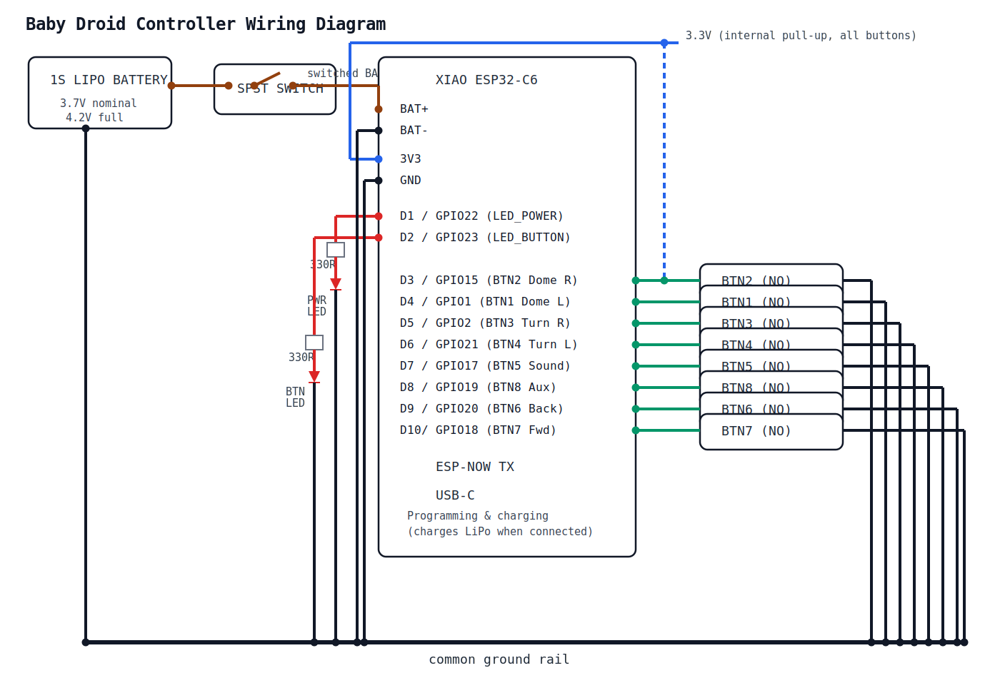

# Baby Droid Controller

**XIAO ESP32C6-based wireless button controller for R2-D2 style droids** using ESP-NOW communication protocol with 8 momentary push buttons, debounced input, and LED status indicators.

This firmware provides the transmitter side of the Baby Droid system, sending a single-byte button bitmask to the companion [baby-droid-chassis](https://github.com/szelenka/baby-droid-chassis) receiver at low latency over ESP-NOW.

---

## 📋 Table of Contents

- [Features](#features)
- [Hardware Requirements](#hardware-requirements)
- [Wiring Plan](#wiring-plan)
- [Software Requirements](#software-requirements)
- [Quick Start](#quick-start)
- [Detailed Setup](#detailed-setup)
- [Configuration Guide](#configuration-guide)
- [Control Mapping](#control-mapping)
- [Architecture](#architecture)
- [Troubleshooting](#troubleshooting)
- [Project Structure](#project-structure)

---

## ✨ Features

- **Wireless Control**: ESP-NOW protocol for low-latency, reliable communication
- **8-Button Input**: Simultaneously read up to 8 momentary push buttons
- **Debounced Input**: 50ms software debounce prevents false triggers
- **Bitmask Protocol**: Single-byte payload encodes all button states simultaneously
- **Continuous Transmission**: Sends updates every 100ms while any button is held
- **Status LEDs**:
  - Power LED blinks at 1Hz to indicate the controller is alive
  - Button LED lights when any button is actively pressed
- **Internal Pull-ups**: No external resistors needed for buttons (INPUT_PULLUP)

---

## 🔧 Hardware Requirements

### Required Components

- **Microcontroller**: Seeed Studio XIAO ESP32C6
- **Buttons**: 8× momentary normally-open push buttons
- **LEDs**: 2× standard LEDs (any color)
  - 1× Power indicator LED
  - 1× Button activity LED
- **Resistors**: 2× `330Ω` current-limiting resistors for LEDs
- **Battery**: 1× `1S LiPo` battery (`3.7V` nominal, `4.2V` fully charged)
- **Power Control**: SPST switch inline on the battery positive lead

> **Power assumption**: the XIAO ESP32C6 has BAT+/BAT- pads on the underside that accept a single-cell LiPo directly. The onboard regulator steps down to 3.3V for the MCU. The built-in charge controller will charge the LiPo whenever USB-C is connected.

> **⚠️ Minimum battery size**: the XIAO ESP32C6 onboard charger draws `380mA` in fast-charge mode ([source](https://wiki.seeedstudio.com/XIAO_ESP32C3_Getting_Started/)). To stay within safe 1C charging limits, use a LiPo cell of **400mAh or larger**. Connecting a smaller cell risks overheating, swelling, or fire — the charger has no way to reduce its current for undersized cells.

### Optional Components

- **Enclosure**: 3D-printed or project box for handheld operation

---

## 🔌 Wiring Plan



### XIAO ESP32C6 Signal Wiring

| Function | XIAO Pin | ESP32-C6 GPIO | Connects To | Notes |
|----------|----------|---------------|-------------|-------|
| Power LED | D1 | GPIO22 | LED anode through `330Ω` to GND | Blinks at 1Hz |
| Button LED | D2 | GPIO23 | LED anode through `330Ω` to GND | ON while any button pressed |
| Button 1 (Dome Left) | D4 | GPIO1 | Button to GND | Internal pull-up enabled |
| Button 2 (Dome Right) | D3 | GPIO15 | Button to GND | Internal pull-up enabled |
| Button 3 (Turn Right) | D5 | GPIO2 | Button to GND | Internal pull-up enabled |
| Button 4 (Turn Left) | D6 | GPIO21 | Button to GND | Internal pull-up enabled |
| Button 5 (Play Sound) | D7 | GPIO17 | Button to GND | Internal pull-up enabled |
| Button 6 (Drive Back) | D9 | GPIO20 | Button to GND | Internal pull-up enabled |
| Button 7 (Drive Fwd) | D10 | GPIO18 | Button to GND | Internal pull-up enabled |
| Button 8 (Auxiliary) | D8 | GPIO19 | Button to GND | Internal pull-up enabled |

### Power Topology

```text
LiPo + -> SPST switch -> XIAO BAT+ pad (underside)
LiPo - -> XIAO BAT- pad (underside)

XIAO onboard regulator -> 3.3V internal rail
3.3V rail -> internal pull-up on each button GPIO
D1 / GPIO22 -> 330Ω -> Power LED anode -> Power LED cathode -> GND
D2 / GPIO23 -> 330Ω -> Button LED anode -> Button LED cathode -> GND
Each button: GPIO pin -> button terminal 1, button terminal 2 -> GND
```

### Wiring Notes

- The SPST switch goes inline on the LiPo positive lead. When open, the board draws zero current.
- Solder the battery wires to the BAT+/BAT- pads on the underside of the XIAO board.
- The XIAO built-in charge controller charges the LiPo whenever USB-C is plugged in (even while the switch is on).
- Each button connects directly between the GPIO pin and GND — two wires per button, nothing else. The firmware enables `INPUT_PULLUP` which activates a resistor inside the chip that holds the pin HIGH; pressing the button shorts the pin to GND (LOW).
- LED resistor value of `330Ω` is suitable for standard 3.3V GPIO output. Adjust if using high-brightness LEDs or a different forward voltage.
- All button and LED grounds connect to the XIAO GND pin(s).
- USB-C provides programming, serial monitoring, and LiPo charging.
- D0 is left unassigned and available for future use.

---

## 💻 Software Requirements

- **PlatformIO**: Install via [platformio.org](https://platformio.org/install)
- **Companion Project**: [baby-droid-chassis](https://github.com/szelenka/baby-droid-chassis) (wireless receiver)

### Dependencies (auto-installed by PlatformIO)

- ESP32 Arduino Framework
- WiFi library (built-in)
- ESP-NOW (built into ESP32 Arduino framework)

---

## 🚀 Quick Start

```bash
# 1. Clone and navigate to project
cd baby-droid-controller

# 2. Get the chassis MAC address
#    (upload chassis firmware first, read MAC from its serial output)

# 3. Configure target MAC address in include/config.h
#    Set TARGET_MAC_ADDRESS to the chassis MAC

# 4. Build and upload firmware (using Makefile)
make upload

# OR using PlatformIO directly
pio run -e release --target upload

# 5. Open serial monitor to verify
make monitor
# OR: pio device monitor

# 6. Press buttons and confirm "Button mask 0bXXXXXXXX sent" messages
```

**Quick commands** (using Makefile):
```bash
make help          # Show all available commands
make release       # Build + upload + monitor
make build         # Build firmware only
make upload        # Upload firmware only
make monitor       # Open serial monitor
make clean         # Clean build files
```

---

## 📖 Detailed Setup

### Step 1: Get Chassis MAC Address

1. Upload firmware to the **chassis** project first
2. Open its serial monitor
3. Copy the MAC address printed at startup:
   ```
   ESP32 MAC Address: {0xAA, 0xBB, 0xCC, 0xDD, 0xEE, 0xFF}
   ```

### Step 2: Configure Controller

1. Edit `include/config.h`
2. Set `TARGET_MAC_ADDRESS` to the chassis MAC:
   ```cpp
   #define TARGET_MAC_ADDRESS {0xAA, 0xBB, 0xCC, 0xDD, 0xEE, 0xFF}
   ```
3. Ensure `WIFI_CHANNEL` matches between both devices (default: `1`)

### Step 3: Build and Upload

```bash
make release
```

### Step 4: Verify Communication

Power on both devices. You should see:
- **Controller serial**: "Button mask 0b00000001 sent" when pressing Button 1
- **Chassis serial**: "Received button mask: 0b1" confirming receipt

### Step 5: (Optional) Enable MAC Filtering on Chassis

For added security, configure the chassis to only accept commands from this controller:

1. Note the **controller's MAC address** (printed in its serial output)
2. Edit `include/config.h` in the **chassis** project
3. Set:
   ```cpp
   #define ALLOWED_CONTROLLER_MAC {0x0C, 0x8B, 0x95, 0x94, 0xF1, 0x00}
   ```

---

## ⚙️ Configuration Guide

All settings are in `include/config.h`:

### LED Pins

```cpp
#define LED_POWER_PIN       D1   // GPIO22 (D1) - Power indicator (blinks 1Hz)
#define LED_BUTTON_PIN      D2   // GPIO23 (D2) - Button activity indicator
```

### Button Pins

```cpp
#define BUTTON_1_PIN        D4   // GPIO1  (D4)  - Spin dome left
#define BUTTON_2_PIN        D3   // GPIO15 (D3)  - Spin dome right
#define BUTTON_3_PIN        D5   // GPIO2  (D5)  - Turn right
#define BUTTON_4_PIN        D6   // GPIO21 (D6)  - Turn left
#define BUTTON_5_PIN        D7   // GPIO17 (D7)  - Play sound
#define BUTTON_6_PIN        D9   // GPIO20 (D9)  - Drive backwards
#define BUTTON_7_PIN        D10  // GPIO18 (D10) - Drive forwards
#define BUTTON_8_PIN        D8   // GPIO19 (D8)  - Auxiliary
```

### Timing Constants

```cpp
#define POWER_LED_BLINK_INTERVAL  1000  // LED blink period (ms)
#define DEBOUNCE_DELAY            50    // Button debounce time (ms)
#define BUTTON_SEND_INTERVAL      100   // Repeat send interval while held (ms)
```

### ESP-NOW Configuration

```cpp
#define TARGET_MAC_ADDRESS {0xF4, 0x65, 0x0B, 0x33, 0x44, 0x8C}  // Chassis MAC
#define WIFI_CHANNEL        1   // Must match chassis WIFI_CHANNEL
```

---

## 🎮 Control Mapping

| Bit | Button | XIAO Pin | GPIO | Function |
|-----|--------|----------|------|----------|
| 0 | Button 1 | D4 | GPIO1 | Dome Left |
| 1 | Button 2 | D3 | GPIO15 | Dome Right |
| 2 | Button 3 | D5 | GPIO2 | Turn Right |
| 3 | Button 4 | D6 | GPIO21 | Turn Left |
| 4 | Button 5 | D7 | GPIO17 | Play Sound |
| 5 | Button 6 | D9 | GPIO20 | Drive Backward |
| 6 | Button 7 | D10 | GPIO18 | Drive Forward |
| 7 | Button 8 | D8 | GPIO19 | Auxiliary |

### Protocol Details

| Property | Value |
|----------|-------|
| **Transport** | ESP-NOW (IEEE 802.11 vendor action frames) |
| **Payload** | 1 byte (uint8_t bitmask) |
| **Encoding** | Bit N = 1 when Button N+1 is pressed |
| **On press** | Send immediately |
| **While held** | Resend every 100ms |
| **On release** | Send updated mask (may be 0x00) |
| **Latency** | ~1-3ms over ESP-NOW |
| **Range** | ~20m line-of-sight |

### Example Bitmask Values

| Buttons Pressed | Bitmask | Hex |
|-----------------|---------|-----|
| None | `00000000` | `0x00` |
| Forward only | `01000000` | `0x40` |
| Forward + Turn Left | `01001000` | `0x48` |
| Dome Left + Forward | `01000001` | `0x41` |

---

## 🏗️ Architecture

### Execution Flow

```
setup()
  ├── Initialize LED pins (OUTPUT)
  ├── Initialize button pins (INPUT_PULLUP)
  └── Initialize ESP-NOW (WiFi STA, register peer, send callback)

loop() [every iteration]
  ├── Blink power LED (toggle every 1000ms)
  ├── Read all 8 buttons with debounce
  ├── Build bitmask from debounced states
  ├── If state changed OR periodic update due:
  │     └── Send 1-byte bitmask via ESP-NOW
  └── Update button activity LED
```

### Communication Flow

```
Button Press → Debounce (50ms) → Build Bitmask → ESP-NOW Send → Chassis Receives
                                                                       ↓
                                              Chassis: Decode Bitmask → Drive Servos
```

### Safety Features

1. **Debouncing**: 50ms delay prevents false triggers from switch bounce
2. **Periodic Resend**: 100ms retransmission ensures the chassis stays in sync even if a packet is lost
3. **Implicit Release**: Chassis uses a 500ms command timeout — if the controller stops sending, motors stop automatically

---

## 🐛 Troubleshooting

### No Communication With Chassis

**Symptoms**: No "Received button mask" on chassis serial.

**Checks**:
1. **MAC address** in `TARGET_MAC_ADDRESS` matches chassis (get from chassis serial output)
2. **WiFi channel** matches (`WIFI_CHANNEL` must be identical on both)
3. **MAC filtering** disabled on chassis, or controller MAC whitelisted
4. Both devices powered on and within range (~20m line-of-sight)
5. Both devices using the same ESP32 Arduino platform version

---

### Buttons Not Registering

**Symptoms**: No serial output when pressing buttons.

**Checks**:
1. Button wired between GPIO and GND (not VCC)
2. Correct XIAO pin numbers in `config.h` (use D-pin names, not raw GPIO)
3. No solder bridges or loose connections
4. Try a different button to isolate hardware vs. software

---

### LED Not Blinking / Not Lighting

**Checks**:
1. LED polarity correct (anode to resistor, cathode to GND)
2. Resistor value appropriate (330Ω for 3.3V GPIO)
3. Correct XIAO pin in `config.h`

---

### Intermittent Connection

**Possible causes**:
- **Distance**: Move closer than 20m, avoid metal obstructions
- **Channel congestion**: Try a different `WIFI_CHANNEL` (1-13) on both devices
- **Power supply**: Ensure stable USB power (some cables/ports are unreliable)

---

### Compilation Errors

**Platform issues**:
```bash
pio platform update espressif32
```

**Clean rebuild**:
```bash
make clean && make build
```

---

## 📁 Project Structure

```
baby-droid-controller/
├── include/
│   └── config.h              # All configuration constants
├── src/
│   └── main.cpp              # Main firmware (ESP-NOW, button reading, LEDs)
├── docs/
│   └── wiring-diagram.svg    # Controller wiring diagram
├── platformio.ini            # PlatformIO build configuration
├── Makefile                  # Convenience commands for building
├── LICENSE                   # CC BY-NC-SA 4.0 license
├── README.md                 # This file
└── .gitignore
```

### Key Files

- **`src/main.cpp`**: Core firmware with ESP-NOW initialization, debounced button reading, bitmask encoding, and LED control
- **`include/config.h`**: All tunable parameters (pins, timing, target MAC address)
- **`platformio.ini`**: Build settings, board definition, library dependencies

---

## 📝 License

This project is licensed under the **Creative Commons Attribution-NonCommercial-ShareAlike 4.0 International License (CC BY-NC-SA 4.0)**.

**TL;DR**: Free for personal/educational use, no commercial use without permission.

See the [LICENSE](LICENSE) file for full details, including third-party library licenses.
